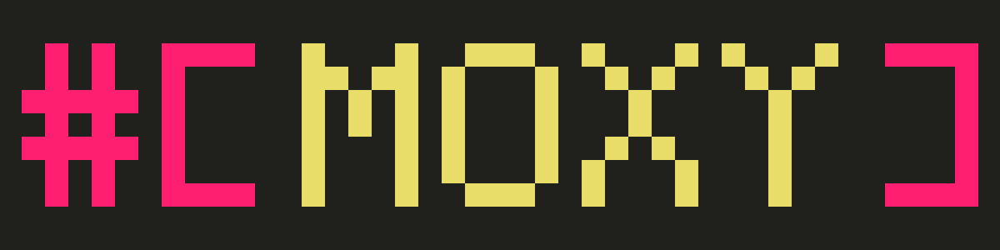

A proc-macro development framework.

## Features

- [`token`](#tokensspans)
- [`ast`](#abstract-syntax-tree-ast)
- [`template`](#templates)
- [`fmt`](#formatting)
- [`diagnostic`](#diagnostics)
- `serde` - adds serde support for all token/ast/error types.
- `proc-macro2` - bridge between our token types and proc-macro2's.
- `syn` - bridge between our AST types and syn types.

## Tokens/Spans

## Abstract Syntax Tree (AST)

## Templates

## Formatting

## Diagnostics
